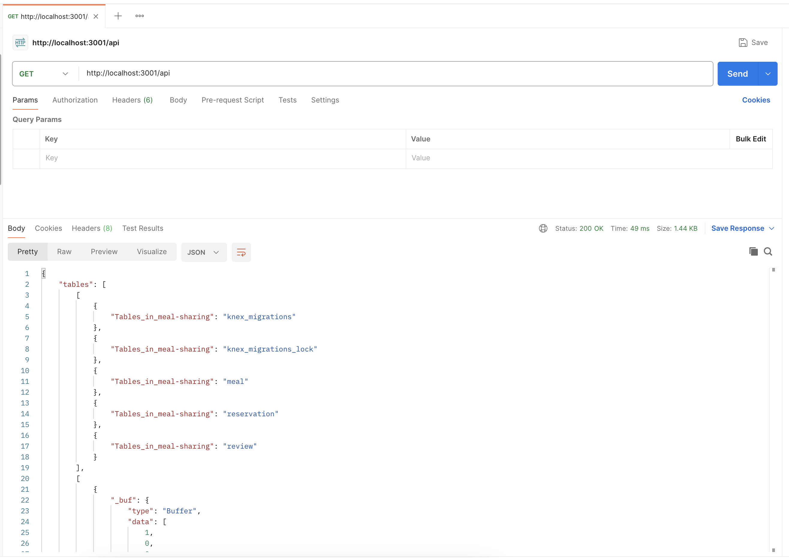

Very velcome to my project meal-sharing


- `api` which is a NodeJS project using Express for the API
- `app` which is Vite project using React for the web app


## Getting started

git clone https://github.com/melo4yxa77796/meal-sharing.git

To get started you'll need two terminals.

In the first terminal run the following commands:

```
cd api
cp .env-example .env
npm install
npm run dev
```

You can then test the API using [Postman](https://www.postman.com/) at [http://localhost:3001/api](http://localhost:3001/api).


In the second terminal run the following commands:

```
cd app
npm install
npm run dev
```


 


  


[Database and API deployment instructions](./api/README.md#deploying)  
[App deployment instructions](./app/README.md#deploying-a-static-web-app)
